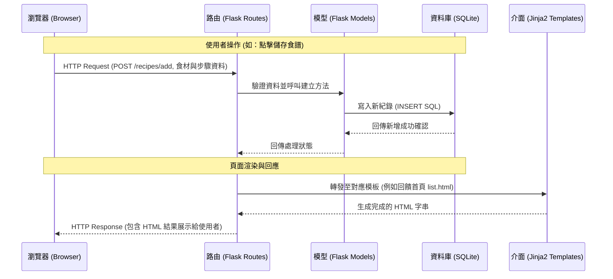

# 食譜收藏夾 系統架構文件

本文件根據 `docs/PRD.md` 所列載的需求，並基於指定技術限制，規劃「食譜收藏夾」系統的整體技術架構。

---

## 1. **技術架構說明**

### 選用技術與原因
- **後端框架：Python + Flask**
  - 原因：Flask 是一個輕量級的微框架，適合快速開發中小型網頁應用。它提供了極大的彈性，讓我們能專注於食譜儲存、搜尋與使用者管理的業務邏輯開發。
- **模板引擎：Jinja2**
  - 原因：內建於 Flask 中，不需額外的學習成本與設定，可以將後端資料無縫渲染成前端 HTML 頁面。符合本系統「不需前後端分離」的開發策略，大幅降低了初始原型的建置時程。
- **資料庫：SQLite (藉由 sqlite3 或 SQLAlchemy 操作)**
  - 原因：SQLite 的資料儲存於單一檔案中，配置與部署門檻極低。對於初期「食譜收藏」功能（儲存文字、標籤等結構單純的資料），效能完全能夠支撐，是輕量級專案的首選。

### Flask MVC 模式說明
雖然 Flask 本身不強制要求 MVC（Model-View-Controller），但為了維護性考量，我們採用類似的結構進行開發：
- **Model (資料模型)**：負責定義資料結構（如 User、Recipe、Tag 等）與處理資料庫讀取/寫入（例如：儲存食譜、比對密碼）。
- **View (視圖)**：由 Jinja2 與 HTML 負責，單純地接收 Controller 處理好的資料並展示給使用者（例如：食譜列表頁、新增食譜的表單頁）。
- **Controller (控制器/路由)**：由 Flask 的 Routes (`@app.route`) 負責，接收瀏覽器的請求（如搜尋關鍵字、提交新增的食譜表單），呼叫 Model 取得或更新資料後，將最後狀態交給 View 渲染回傳給網頁。

---

## 2. **專案資料夾結構**

以下是本專案推薦的目錄樹狀圖，依據 MVC 職責分離：

```text
web_app_development/
├── app/
│   ├── models/            ← 資料庫模型，與 SQLite 溝通的邏輯
│   │   ├── __init__.py
│   │   ├── user.py        ← 使用者帳號與權限模型
│   │   └── recipe.py      ← 食譜、分類標籤、收藏關聯模型
│   ├── routes/            ← Flask 路由（Controller）模組
│   │   ├── __init__.py
│   │   ├── auth.py        ← 負責註冊、登入與登出邏輯
│   │   └── recipes.py     ← 負責食譜 CRUD (新增/讀取/更新/刪除) 與搜尋邏輯
│   ├── templates/         ← Jinja2 HTML 模板
│   │   ├── base.html      ← 共同的版型框架 (包含導覽列與共用區塊)
│   │   ├── auth/          ← 登入與註冊頁面
│   │   │   ├── login.html
│   │   │   └── register.html
│   │   └── recipes/       ← 食譜相關頁面
│   │       ├── list.html  ← 食譜列表
│   │       ├── detail.html← 單一食譜詳細介紹
│   │       └── form.html  ← 新增/編輯食譜的表單頁
│   └── static/            ← 靜態資源檔案
│       ├── css/
│       │   └── style.css  ← 自訂的樣式表
│       ├── js/
│       │   └── main.js    ← 前端互動微調 (非必要)
│       └── images/        ← 平台預設圖片、Logo
├── instance/
│   └── database.db        ← SQLite 資料庫檔案 (需加入 .gitignore)
├── docs/                  ← 專案文件
│   └── PRD.md             ← 產品需求文件
│   └── ARCHITECTURE.md    ← 系統架構文件 (本文件)
├── requirements.txt       ← 專案相依套件清單 (列出 Flask, SQLAlchemy 等)
├── config.py              ← 存放環境變數或專案設定 (如 SECRET_KEY)
└── app.py                 ← 系統啟動入口
```

---

## 3. **元件關係圖**

系統各元件運作流程如下圖所示：



---

## 4. **關鍵設計決策**

1. **統一頁面渲染 (SSR - Server Side Rendering)**
   * **決策**：棄用前端框架（如 React/Vue）來實作單頁應用 (SPA)，統一交由 Flask 將準備好的變數放入 Jinja2 中在後端生成完整 HTML 再丟給瀏覽器。
   * **原因**：根據 PRD 指定技術，我們不採用前後端分離，這可大幅降低開發複雜度與跨域請求 (CORS) 的設定問題，也能讓開發重點圍繞在「伺服器邏輯」與「資料庫關聯」本身。
2. **採用藍圖 (Flask Blueprints) 切分路由**
   * **決策**：將路由依照業務拆分成多個檔案，例如：`auth.py` 及 `recipes.py`，而非全部塞進單一檔案 `app.py` 中。
   * **原因**：為了預防專案未來擴展（如加入分享功能、留言板或管理員頁面），以 Blueprint 來分類 Controller 可以增加程式碼的易讀性並避免模組過於龐大難以找尋。
3. **資料庫讀寫拆分模型化**
   * **決策**：在 `app/models/` 資料夾中將資料庫操作單獨封裝成 Python 物件，讓 Controller 在操作資料時是使用如 `Recipe.create()` 而非直接在 Controller 內撰寫艱澀複雜的原生 SQL。
   * **原因**：提升程式安全性（有效防禦 SQL Injection，這也是 PRD 開出的非功能需求），讓商業邏輯更集中，方便未來的管理與重構。
4. **檔案目錄安全性考量**
   * **決策**：將 SQLite 資料庫放置在隔離於網頁伺服器讀取範圍外的 `instance/` 資料夾，且不作為靜態資源對外開放。
   * **原因**：防止有心人士輕易透過 URL 直接下載包含使用者密碼（雖經加密）與個人食譜的完整 `.db` 資料庫檔案。
