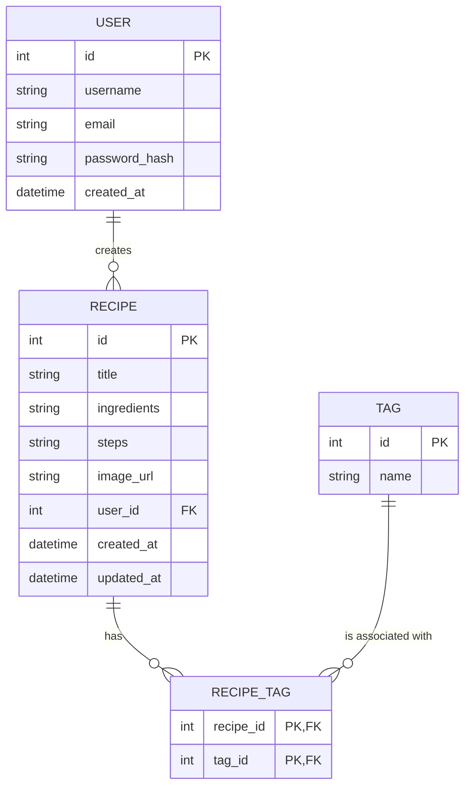

# 資料庫設計文件 (DB Design)

## 1. ER 圖

## 2. 資料表詳細說明

### USER (使用者表)
儲存平台使用者的基本登入資訊。
- `id` (INTEGER): 主鍵，自動遞增。
- `username` (TEXT): 使用者名稱，必填且唯一。
- `email` (TEXT): 電子郵件，必填且唯一。
- `password_hash` (TEXT): 加密後的密碼，必填。
- `created_at` (DATETIME): 建立時間，預設為當前時間。

### RECIPE (食譜表)
儲存食譜的核心內容，每篇食譜皆隸屬於一位使用者。
- `id` (INTEGER): 主鍵，自動遞增。
- `title` (TEXT): 食譜名稱，必填。
- `ingredients` (TEXT): 食材清單，必填。
- `steps` (TEXT): 製作步驟，必填。
- `image_url` (TEXT): 食譜圖片連結，非必填。
- `user_id` (INTEGER): 外鍵，關聯至 `USER.id`，必填。
- `created_at` (DATETIME): 建立時間，預設為當前時間。
- `updated_at` (DATETIME): 更新時間，預設為當前時間。

### TAG (標籤表)
儲存自訂標籤或預設分類（例如中式、甜點等）。
- `id` (INTEGER): 主鍵，自動遞增。
- `name` (TEXT): 標籤名稱，必填且唯一。

### RECIPE_TAG (食譜與標籤關聯表)
記錄食譜與標籤的多對多關係。
- `recipe_id` (INTEGER): 外鍵，關聯至 `RECIPE.id`。
- `tag_id` (INTEGER): 外鍵，關聯至 `TAG.id`。
- Primary Key (主鍵) 由 (`recipe_id`, `tag_id`) 組成。

## 3. SQL 建表語法
請見 `database/schema.sql`。

## 4. Python Model 程式碼
請見 `app/models/` 目錄下的各個檔案：
- `app/models/user.py`
- `app/models/recipe.py`
- `app/models/tag.py`
