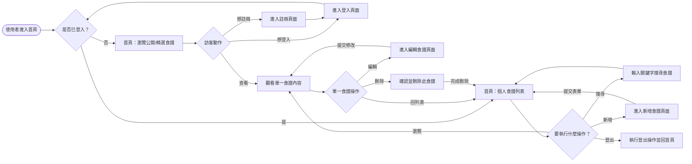
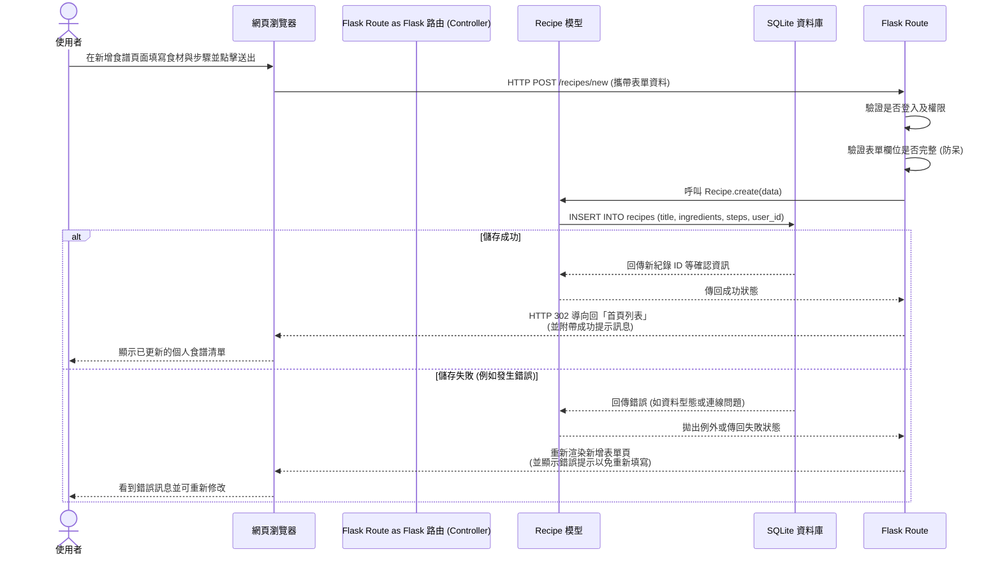

# 食譜收藏夾 流程圖與路由設計

本文件根據 `docs/PRD.md` 中定義的系統功能需求與 `docs/ARCHITECTURE.md` 制定的技術架構，繪製了對應的系統流程邏輯，包含使用者視角的頁面流轉、伺服器端的資料寫入序列，以及功能與路由對照表。

---

## 1. 使用者流程圖（User Flow）

此流程圖涵蓋了一般使用者從進入網站開始，所能進行的所有主要操作路徑（包含瀏覽、尋找、管理自身食譜及會員登入登出操作）。

---

## 2. 系統序列圖（Sequence Diagram）

以下序列圖展示了 PRD 中「儲存食譜」這項核心功能，在內部元件（瀏覽器、Flask、SQLite）之間是如何流動與處理的。

---

## 3. 功能清單對照表

將上述操作路徑對應至 Flask 路由設計中，初步規劃出以下 URL Endpoint 及 HTTP Methods：

| 功能項目 | URL 路徑 | HTTP 方法 | 對應的 Jinja2 模板 (View) |
| --- | --- | --- | --- |
| 瀏覽首頁 (食譜列表) | `/` | GET | `recipes/list.html` |
| 瀏覽食譜細節 | `/recipes/<id>` | GET | `recipes/detail.html` |
| 搜尋食譜 | `/recipes/search` | GET | `recipes/list.html` |
| 進入新增食譜頁面 | `/recipes/new` | GET | `recipes/form.html` |
| 提交新增食譜表單 | `/recipes/new` | POST | (轉址至 `/`) |
| 進入編輯食譜頁面 | `/recipes/<id>/edit` | GET | `recipes/form.html` |
| 提交編輯食譜表單 | `/recipes/<id>/edit` | POST | (轉址至 `/recipes/<id>`) |
| 執行刪除食譜 | `/recipes/<id>/delete` | POST | (轉址至 `/`) |
| 進入登入頁面 | `/login` | GET | `auth/login.html` |
| 執行登入驗證 | `/login` | POST | (轉址至 `/`) |
| 進入註冊頁面 | `/register` | GET | `auth/register.html` |
| 執行註冊帳號 | `/register` | POST | (轉址至 `/login`) |
| 執行登出系統 | `/logout` | GET (或 POST) | (轉址至 `/`) |
